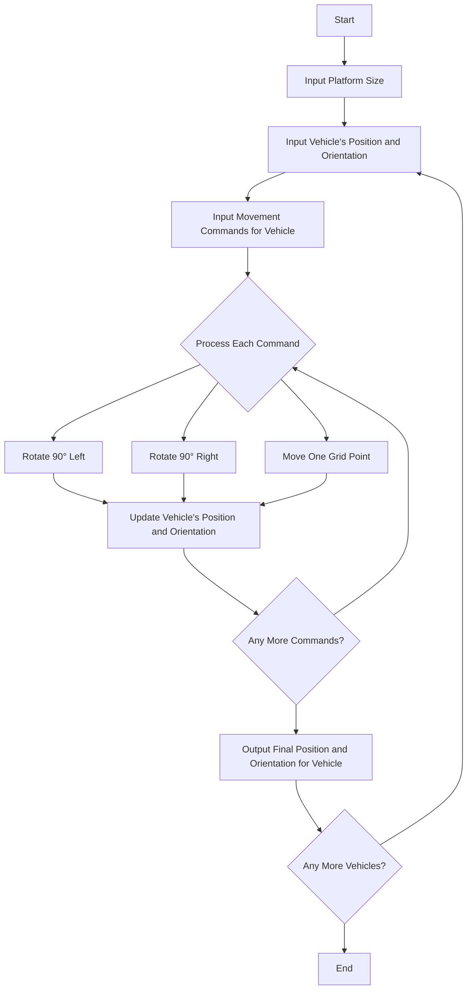

# Flowchart for the Matrix Miles Project

```mermaid
graph TD

    Start[Start] --> InputPlatform[Input Platform Size]

    InputPlatform --> InputVehicle[Input Vehicle's Position and Orientation]
    InputVehicle --> InputCommands[Input Movement Commands for Vehicle]
    
    InputCommands --> ProcessCommand{Process Each Command}
    ProcessCommand --> RotateL[Rotate 90° Left]
    ProcessCommand --> RotateR[Rotate 90° Right]
    ProcessCommand --> Move[Move One Grid Point]

    RotateL --> UpdateVehiclePosition[Update Vehicle's Position and Orientation]
    RotateR --> UpdateVehiclePosition
    Move --> UpdateVehiclePosition

    UpdateVehiclePosition --> NextCommand{Any More Commands?}
    NextCommand --> ProcessCommand
    NextCommand --> OutputPosition[Output Final Position and Orientation for Vehicle]

    OutputPosition --> NextVehicle{Any More Vehicles?}
    NextVehicle --> InputVehicle
    NextVehicle --> End[End]
```
